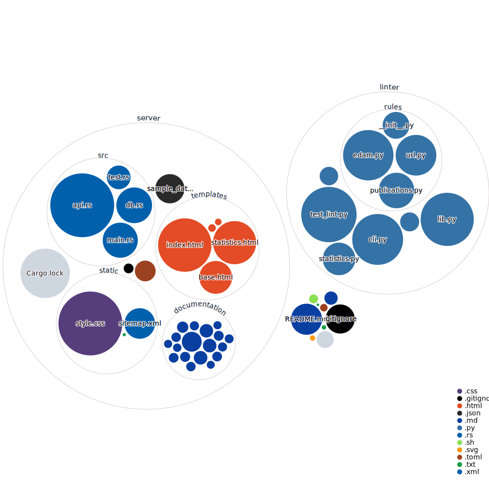

# biotools-linter
[](https://codeclimate.com/github/3top1a/biotools-linter/maintainability)
[](https://app.codacy.com/gh/3top1a/biotools-linter/dashboard?utm_source=gh&utm_medium=referral&utm_content=&utm_campaign=Badge_grade)
[](https://app.codacy.com/gh/3top1a/biotools-linter/dashboard?utm_source=gh&utm_medium=referral&utm_content=&utm_campaign=Badge_coverage)


This is a rule-based linter for the [bio.tools](https://bio.tools/) database. The script searches the bio.tools API for a given tool name and checks various properties of the tool's JSON data, such as invalid URL links.
The bio.tools database is linted every day and the results are available [here](https://biotools-linter.biodata.ceitec.cz/).
You can also use a [development version of the bio.tools](http://biotools-linter.biodata.ceitec.cz:8000) database that automatically checks for errors, however the data will not be saved to the official registery.

## Installation
0) Install prerequisites
    ```sh
    # apt install rustup git python3-pip
    ```

1) Clone this git repository
    ```sh
    $ git clone https://github.com/3top1a/biotools-linter.git
    ```

2) Install python dependencies
    ```sh
    $ pip install -r required.txt
    $ pip install -r required-dev.txt
    ```
3) Build server

    Make sure you have installed rust via [rustup](https://rustup.rs/) correctly.
    ```sh
    $ cd server
    $ cargo build
    ```

## Usage

### linter

```sh
$ python3 linter/cli.py "MetExplore"
Found 1 tools
Linting MetExplore at https://bio.tools/metexplore
metexplore: [EDAM_OBSOLETE] The term "Pathway or network comparison" at MetExplore//function/1/operation/0/uri has been marked as obsolete
metexplore: [EDAM_OBSOLETE] The term "Pathway or network visualisation" at MetExplore//function/1/operation/1/uri has been marked as obsolete
metexplore: [EDAM_OBSOLETE] The term "Pathway or network analysis" at MetExplore//function/0/operation/0/uri has been marked as obsolete
metexplore: [EDAM_OBSOLETE] The term "Pathway or network visualisation" at MetExplore//function/0/operation/1/uri has been marked as obsolete
metexplore: [URL_SSL_ERROR] Detected an invalid or expired TLS certificate while fetching URL https://metexplore.toulouse.inra.fr/metexploreViz/doc/documentation.php at MetExplore//documentation/1/url: Cannot connect to host metexplore.toulouse.inra.fr:443 ssl:True [SSLCertVerificationError: (1, '[SSL: CERTIFICATE_VERIFY_FAILED] certificate verify failed: unable to get local issuer certificate (_ssl.c:1000)')]
metexplore: [URL_SSL_ERROR] Detected an invalid or expired TLS certificate while fetching URL https://metexplore.toulouse.inra.fr/metexplore-doc/index.php at MetExplore//documentation/0/url: Cannot connect to host metexplore.toulouse.inra.fr:443 ssl:True [SSLCertVerificationError: (1, '[SSL: CERTIFICATE_VERIFY_FAILED] certificate verify failed: unable to get local issuer certificate (_ssl.c:1000)')]
metexplore: [URL_SSL_ERROR] Detected an invalid or expired TLS certificate while fetching URL https://metexplore.toulouse.inra.fr/metexplore-webservice-documentation/ at MetExplore//documentation/2/url: Cannot connect to host metexplore.toulouse.inra.fr:443 ssl:True [SSLCertVerificationError: (1, '[SSL: CERTIFICATE_VERIFY_FAILED] certificate verify failed: unable to get local issuer certificate (_ssl.c:1000)')]
metexplore: [URL_SSL_ERROR] Detected an invalid or expired TLS certificate while fetching URL http://www.metexplore.fr/ at MetExplore//homepage: Cannot connect to host metexplore.toulouse.inrae.fr:443 ssl:True [SSLCertVerificationError: (1, '[SSL: CERTIFICATE_VERIFY_FAILED] certificate verify failed: unable to get local issuer certificate (_ssl.c:1000)')]
metexplore: [DOI_BUT_NOT_PMCID] Article 10.1093/nar/gky301 has both DOI and PMCID (PMC6030842), but only DOI is provided. Use NCBI AnyID Converter for verification.
metexplore: [DOI_BUT_NOT_PMID] Article 10.1093/nar/gkq312 has both DOI and PMID (20444866), but only DOI is provided. Use NCBI AnyID Converter for verification.
metexplore: [DOI_BUT_NOT_PMCID] Article 10.1093/nar/gkq312 has both DOI and PMCID (PMC2896158), but only DOI is provided. Use NCBI AnyID Converter for verification.
```

You can also lint the entire bio.tools database

```sh
$ python3 linter/cli.py --lint-all
...
```

To send the results to a PostgreSQL database
```sh
$ export DATABASE_URL="postgres://username:passwd@IP/database"
$ python3 linter/cli.py "MetExplore"
... same as before
Sending messages to database
```
The program will create a new table called `messages` if it doesn't exist and incrementally update it, deleting old entries of the same tool.

### Statistics

There is a python script included at `linter/statistics.py` that generates a JSON file with database statistics.
```sh
$ export DATABASE_URL="postgres://username:passwd@IP/database"
$ python3 linter/statistics.py data.json
```

There is a sample output available at `server/sample_data.json` for testing and development.

### Server

The server is written in rust, make sure to download the latest Rust stable toolchain.
```sh
$ rustup toolchain install stable
# OR
$ rustup update
```

Then compile and run the server
```sh
$ cd server
$ export DATABASE_URL="postgres://username:passwd@IP/database"

# The release flag is optional but recommended for production
# The -- moves arguments from cargo to the program
# The statistics file is not optional! Make sure to include it!
$ cargo run --release -- --port 8080 --stats sample_data.json
# OR 
$ cargo run --release -- --port 8080 --stats /home/x/data.json
```

## Architecture



## Disclaimer
This tool is meant to be a rule-based checker for bio.tools data and does not cover all possible aspects or validations that can be performed on the data. It should be used as an additional tool for evaluating the information retrieved from the bio.tools API.

Please use the tool responsibly and do not misuse or overwhelm the bio.tools API with excessive requests.

## Contribution

All contributions are welcome! 

## License
This project is licensed under the MIT license.
