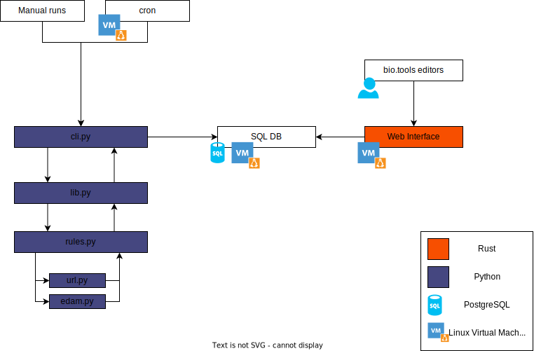

# biotools-linter
[](https://codeclimate.com/github/3top1a/biotools-linter/maintainability)
[](https://app.codacy.com/gh/3top1a/biotools-linter/dashboard?utm_source=gh&utm_medium=referral&utm_content=&utm_campaign=Badge_grade)

This is a rule-based checker for the [bio.tools](https://bio.tools/) database. The script searches the bio.tools API for a given tool name and checks various properties of the tool's JSON data, such as invalid URL links.

## Installation
0) Install prerequisites
    ```sh
    # apt install cargo git python3-pip
    ```

1) Clone this git repository
    ```sh
    $ git clone https://github.com/3top1a/biotools-linter.git
    ```

2) Install dependencies
    ```sh
    $ pip install -r required.txt
    ```

## Usage

### linter

```sh
$ python3 linter/cli.py --threads 16 "MetExplore" -p 1
Search returned 1 results
Starting to lint MetExplore
https://metexplore.toulouse.inra.fr/metexplore-webservice-documentation/ in /documentation/2/url doesn't returns 200 (HTTP_OK)
```

You can also lint the entire bio.tools database

```sh
$ python3 linter/cli.py --threads 16 --lint-all
...
```

To send the results to a PostgreSQL database
```sh
$ export DATABASE_URL="postgres://username:passwd@IP/database"
$ python3 linter/cli.py --threads 16 "MetExplore" -p 1
Starting to lint MetExplore
https://metexplore.toulouse.inra.fr/metexplore-webservice-documentation/ in /documentation/2/url doesn't returns 200 (HTTP_OK)
Sending messages to database
```
The program will create a new table called `messages` if it doesn't exist and incrementally update it.

### Statistics

There is a python script included at `linter/statistics.py` that generates a JSON file with database statistics.
```sh
$ export DATABASE_URL="postgres://username:passwd@IP/database"
$ python3 linter/statistics.py /home/x/data.json
```

If you do not need it, there is a sample output located at `server/sample_data.json`.

### Server

The server is written in rust, make sure to download the latest Rust stable toolchain.
```sh
$ rustup toolchain install stable
# OR
$ rustup update
```

Then compile and run the server
```sh
$ cd server
$ export DATABASE_URL="postgres://username:passwd@IP/database"

# The release flag is optional but recommended for production
# The -- moves arguments from cargo to the program
# The statistics file is not optional! Make sure to include it!
$ cargo run --release -- --port 8080 --stats sample_data.json
# OR 
$ cargo run --release -- --port 8080 --stats /home/x/data.json
```

## Architecture


## Disclaimer
This tool is meant to be a rule-based checker for bio.tools data and does not cover all possible aspects or validations that can be performed on the data. It should be used as an additional tool for evaluating the information retrieved from the bio.tools API.

Please use the tool responsibly and do not misuse or overwhelm the bio.tools API with excessive requests.

## Contribution

All contributions are welcome! 

## License
This project is licensed under the MIT license.
